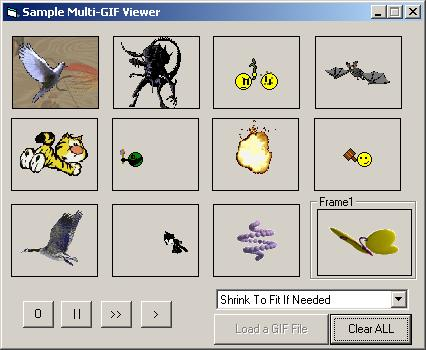



## LaVolpe GIF Viewer 3

### Description

An extremely resource friendly, unique approach to viewing animated GIFs. Draw to any DC (no need for transparent usercontrols, timers). Self-contained class creates own timer, back buffer for flicker free drawing, and parses/renders animation frames. This new approach uses just 2 GDI objects per GIF, regardless how many frames it may have. It uses 0 to 3 more GDI objects for flicker-free drawing depending on animation settings and target DC contents. Well commented. Recommended improvements welcomed. This is not a GIF editor. 

----

5Aug06: Patched to address: Clearing solid bkg would overpaint 1 pixel width &amp; height. Refreshing scaled single frame GIF could rescale from scaled dimensions &amp; not original dimensions. Offscreen DC could be created (wasted resource) when not needed. 26Fe07. Added ability to quick-render 1st frame of GIF. Previously, ppl said they didn't like the delay between loading &amp; displaying image.
 
### More Info
 

             |
---                |---
**Submitted On**   |2007-02-26 15:00:04
**By**             |[LaVolpe](https://github.com/Planet-Source-Code/PSCIndex/blob/master/ByAuthor/lavolpe.md)
**Level**          |Advanced
**User Rating**    |4.9 (142 globes from 29 users)
**Compatibility**  |VB 6\.0
**Category**       |[Graphics](https://github.com/Planet-Source-Code/PSCIndex/blob/master/ByCategory/graphics__1-46.md)
**World**          |[Visual Basic](https://github.com/Planet-Source-Code/PSCIndex/blob/master/ByWorld/visual-basic.md)
**Archive File**   |[LaVolpe\_GI2050442262007\.zip](https://github.com/Planet-Source-Code/lavolpe-lavolpe-gif-viewer-3__1-66160/archive/master.zip)

